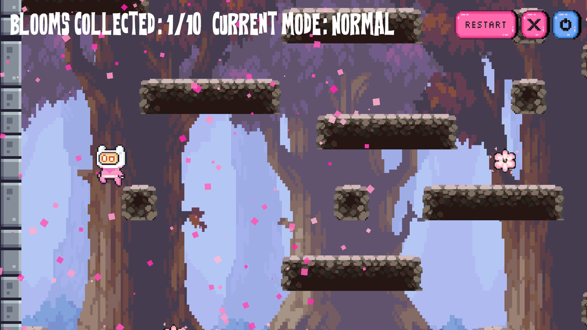

# **Boom Or Bloom**
🌸 Created by xenaria for Midterm Game Jam 2025 .

## **How to Run**

- System requirements: Windows or macOS
- Unity Version 6000.0.56f1
- Keyboard and mouse required
- [File here](https://drive.google.com/drive/folders/1lmrfsM5aa60RBr7GVA8BdtbsEDZVPwzQ?usp=drive_link)

### Gameplay Recording

[Video here](https://drive.google.com/drive/folders/1lmrfsM5aa60RBr7GVA8BdtbsEDZVPwzQ?usp=drive_link)

## Chosen Theme

"The right man in the wrong place can make all the difference in the world."

## Game Description

**Boom or Bloom** is a cute little platformer that takes the theme literally. There's nothing abstract about it;  

If you’re in the wrong place - you explode! (well, the bomb explodes and you die...)

The world shifts when you die, and flowers begin to bloom where you once were, so even failure changes the world around you.

There are two modes:
- **Normal Mode**: Being in the wrong place (detonating a bomb) kills you.
- **Twist Mode** (secondary requirement): Being in the wrong place rewards you instead; flowers can only be collected it's within the explosion radius of a detonating bomb!  
- In both modes, players are required to collect a total of 10 flowers.

The setting is bright and full of blossoms - calm, warm, and slightly dreamy (AND REALLY PRETTYYY CUTE FLOWERS) . I wanted the world to feel gentle even when things go wrong, so that dying doesn’t feel punishing but rather part of the world’s rhythm, and maybe even something to look forward to.

Overall, the game is about finding beauty even when you fail - turning “boom” moments into “blooms.”

## **Core Mechanic**

The core mechanic is reflex! The bombs are hidden so you don't know where they are. 

In the normal game mode, players are required to jump or move to a different area quickly once they trigger a bomb to avoid getting hit within its explosion radius. Once hit, player immediately dies.

## **Game Procedure & Controls**

The player uses his/her keyboard to control the character and complete the objective (collect 10 flowers).

List of inputs:
- **A / D** – Move character
- **Spacebar** – Jump

## **Core Drive (Tally with Design Principles, Balance, and Intentional Design)**

 **Unpredictability & Curiosity**: 
The player never knows where the bombs are in both Normal and Twist modes. This sense of uncertainty makes the game exciting - Players are constantly engaged with the question "is there gonna be a bomb here?". This pushes them to explore the map more carefully, whether they’re trying to avoid the bombs in Normal mode or find them in Twist mode.

## **Game Balance Efforts (Tally with Rubric)**

**Risk vs. Reward**: 
In Normal Mode, taking risks (collecting the flower knowing there's probably a bomb nearby) often leads to death. 

Meanwhile, in Twist Mode, what you once tried to avoid becomes the key to success. The flowers are only collected if it gets hit within the bomb's explosion radius. This means that instead of avoiding the bomb, you're _looking_ for them instead!

This balance between safety and risk creates tension - you’re constantly weighing if you want to step into the danger or just have fun with it - and both are equally challenging!

## **Unique Rule (Tally with Rubric)**

**Breaking a Rule:**
In most games, being in the “wrong place” means losing. Here, that rule can be flipped. The wrong place can also be the right place, depending on the mode. This simple rule change redefines how the player perceives danger and reward, keeping gameplay fresh and a little ironic.

## **Game Design Principles Incorporated**

- **Grounding the Player**: Visual cues (like bloom particle effects and bomb explosions) clearly show what’s safe or dangerous. The UI design also shows the things they need to know: how many flowers left to collecta and what game mode they're playing.
- **Player Empathy**: The visuals and sounds are gentle, so even failure feels like growth - not punishment - you constantly want to keep getting better as you learn how to control your character.

## Code Cleanliness Efforts (Bonus)

Made use of Scriptable Objects for:
- LevelData: Used to spawn world - platforms, bombs (booms) and flowers (blooms).
- IntVariable: Used for score checking.

Made use of Singleton Game Manager:
- To ensure that all events are listening to the same Game Manager when game begins.

## Credits
Assets credited below!
| Asset                               | Credit        
| :-----------------------------------| :----------- |
| Player Sprite & World border tilemap| [PixelFrog from itch.io](https://pixelfrog-assets.itch.io/pixel-adventure-1)
| Background & Platforms              | [brullov from itch.io](https://brullov.itch.io/oak-woods)   
| Sound Effects                       | [Youtube](https://youtube.com/playlist?list=PLKGQUSiHMEPeP42SR4zUlV-cOpI5LSQXr&si=fnRrWAIvoV_t5Lpm)     
